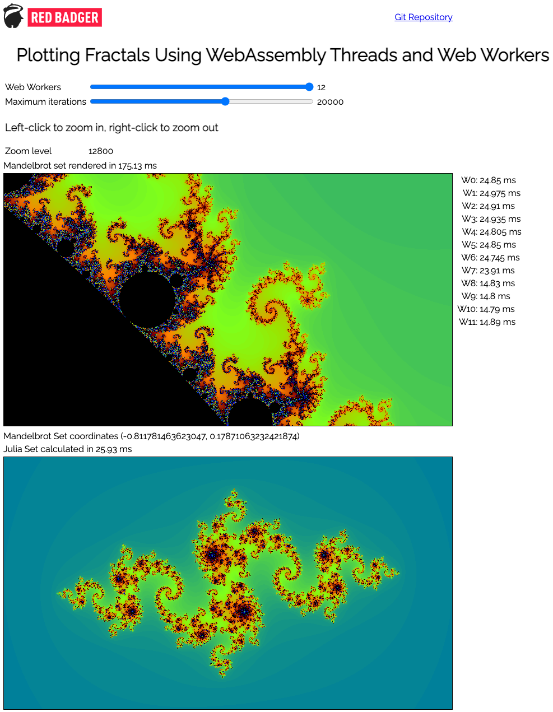

# Writing in Raw WebAssembly Text

## Motivation

Two of the key advantages of writing in raw WebAssembly Text (WAT) are that you can:

1. Create code that compiles to the smallest possible (or at least very small) binary file
1. Create code that runs really fast

Some would argue that us humans need not concern ourselves too deeply with these tasks because modern compilers are efficient enough to relieve us of this particular workload.
Well, maybe, kind of &mdash; but no, not really.

By writing the numerically intensive part of this application directly in thread-enabled WebAssembly Text, I have managed to get the generated WASM binary files down to just under 1Kb!
However, the equivalent code written in Rust and then compiled to WASM using `wasm-pack` is 116 times larger at just over 74Kb.

## Objectives

This was a learning exercise with the following objectives:

1. Learn how to write and test libraries in raw WebAssembly Text
1. Learn how to get those libraries to interact
1. Learn to use WebAssembly threads
1. Learn how the optimizer tool `wasm-opt` reduces a WASM file size then apply those techniques when first writing the code

Originally, three WASM modules were developed: `mandel.wasm`, `colour_palette.wasm` and `canvas.wasm`; but this has now been reduced to a single module `mj_plot.wasm`.

> ### Testing
> 
> During development, it was necessary to test the functions exported from each WASM library.
> So I developed a small test framework that picks up a WASM module and attempts to find a test for every exported function.
> It then reports on whether or not a test was found, and if so, reports the test outcome.
> 
> This code is still present in the repo but has been removed from `index.html`.

## Implementation

[Live demo](https://raw-wasm.pages.dev/)



As you move the mouse pointer over the image of the Mandebrot Set, the Julia Set corresponding to the mouse pointer's position in the complex plane is then plotted.

You can drag the Mandelbrot set image to reposition it.

By moving the sliders, you can change the following parameters of the Mandelbrot Set:

* ***Web Workers***  
   The number of Web Works can be varied in order to compare performance times.
   Each time this value is changed, the Web Worker collection is thrown away and rebuilt.

* ***Maximum Iterations***  
   The maximum number of times the escape time algorithm is run to calculate a pixel's value.
   The higher this value, the longer the escape time algorithm will take to run.
   The calculation of the Mandelbrot Set can be optimised by knowing that any point within the main cardioid or the period-2 bulb will always escape to infinity, thus such points can immediately be coloured black.
   However, no such optimisation exists for calculating a Julia Set.

* ***Zoom level***  
   The zoom level shows the number of pixels per unit on the complex plane

## Local Execution

If you want to compile the WebAssembly Text yourself, then you should install the relevant WebAssembly tools.
Several options are available here, but I have developed this app using the WebAssembly tools from [`wasmer.io`](https://docs.wasmer.io/ecosystem/wasmer/getting-started)

> ***IMPORTANT***
> 
> 1. Due to the fact that these WebAssembly programs access shared memory using atomic read-modify-write instructions, they must be compiled with the `--enable-threads` option when running both `wat2wasm` and `wasm-opt`
> 
> 1. If you'd like to run this app locally, you will need to modify your Web Server configuration such that the server responds with these headers:
>
>   For instance, if you use Apache as your Web server, then in `httpd.conf`, you will need to modify the `headers_module` section:
> 
>  ```
>  <IfModule headers_module>
>       Header set Cross-Origin-Embedder-Policy "require-corp"
>       Header set Cross-Origin-Opener-Policy "same-origin"
>  </IfModule>
>  ```
> 
>   Restart your Web Server


1. Clone the repo into a directory accesible from a Web Server.
This is necessary because browsers typically do not allow WebAssembly modules to be transfered using the `file://` protocol.
1. Assuming you have the tools `wat2wasm` and `wasm-opt` installed, run `make` followed by `make opt`
1. Point your browser to `index.html`
1. As you move the mouse pointer over the Mandelbrot Set, the Julia Set corresponding to that location will be rendered in the canvas below

Enjoy!
